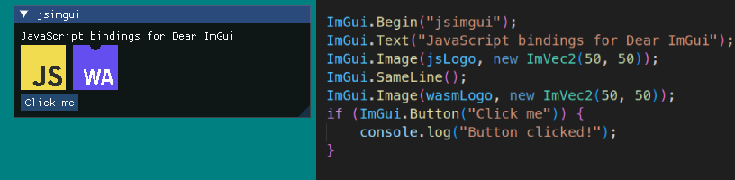

# jsimgui: JavaScript bindings for Dear ImGui

JavaScript bindings for the [Dear ImGui](https://github.com/ocornut/imgui) library. Currently only compatible with WebGL2.



```js
ImGui.Begin("jsimgui");
ImGui.Text("JavaScript bindings for Dear ImGui");
ImGui.Image(jsLogo, new ImVec2(50, 50));
ImGui.SameLine();
ImGui.Image(wasmLogo, new ImVec2(50, 50));
if (ImGui.Button("Click me")) {
    console.log("Button clicked!");
}
```


## Features

- Simple API which tries to feel familiar to the original
- Original comments preserved from Dear ImGui
- Good IDE support thanks to TypeScript
- Docking branch features
- WebGL2 backend, easily usable with Three.js

## Examples

- **WebGL2**: Basic example using a WebGL2 clear canvas - [View Example](https://mori2003.github.io/jsimgui/docs/examples/webgl/)
- **Three.js**: Integration with Three.js WebGL2 renderer - [View Example](https://mori2003.github.io/jsimgui/docs/examples/threegl/)

## Todo
The library is currently in a very early stage but core functionality is there. Expect bugs and missing features!

Currently missing but planned:

- Better font support: custom fonts, icon/emoji fonts...
- Clipboard support
- Saving ImGui settings
- WebGPU backend


## Getting Started

The package is available both on [JSR](https://jsr.io/@mori2003/jsimgui/) and [npm](https://www.npmjs.com/package/@mori2003/jsimgui). Use it with your favorite package manager or with a CDN like [ESM](https://esm.sh/).

```bash
npm add @mori2003/jsimgui
deno add @mori2003/jsimgui
bun add @mori2003/jsimgui
```

Integrate it into your project.

```js
import { ImGui, ImGuiImplWeb } from "@mori2003/jsimgui";
// via CDN
// import { ImGui, ImGuiImplWeb } from "https://esm.sh/@mori2003/jsimgui";

const canvas = document.querySelector("#your-canvas");
await ImGuiImplWeb.Init(canvas);

function frame() {
    ImGuiImplWeb.BeginRender();

    ImGui.Begin("New Window");
    ImGui.Text("Hello from JS!");
    ImGui.End();

    // Render your scene...

    ImGuiImplWeb.EndRender();
    requestAnimationFrame(frame);
}
requestAnimationFrame(frame);
```

## API Notes

### Arrays

Arrays are modified in-place when passed as arguments. Single-sized arrays are also used for references:

```js
const color = [0.2, 0.8, 0.5];
ImGui.ColorEdit3("BackgroundColor", color); // Modifies the color array.
const isVisible = [true];
ImGui.Checkbox("Show Window", isVisible); // Modifies isVisible[0].
```

### Enums

Enums names have been shortened. E.g. `ImGuiWindowFlags_None` as `ImGui.WindowFlags.None`.

```js
ImGui.SetNextWindowPos(new ImVec2(10, 10), ImGui.Cond.Once);
```

## Building

**Prerequisites:**

- A Node.js compatible runtime (Node.js, Deno, Bun)
- [Emscripten](https://emscripten.org/)
- [Python](https://www.python.org/) with [Ply](https://pypi.org/project/ply/) (For dear_bindings)

**Build:**

1. Clone the repository with submodules

```bash
git clone https://github.com/mori2003/jsimgui.git --recurse-submodules
cd jsimgui
```

2. Run the build script

```bash
# Node.js & npm
npx tsx build.ts
# Deno
deno run build.ts
# Bun
bun run build.ts
```

## Project Structure

```
bindgen/      # Generated C++ and TypeScript bindings
build/        # Distribution files
docs/         # Usage examples
src/          # Bindingsgenerator source code
third_party/  # Dependencies (imgui, dear_bindings)
```
