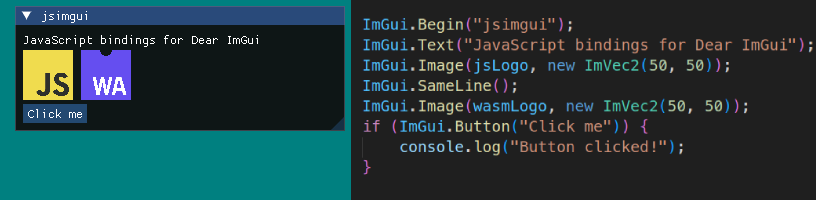

# jsimgui: JavaScript bindings for Dear ImGui

[](https://www.npmjs.com/package/@mori2003/jsimgui)
[](https://jsr.io/@mori2003/jsimgui)




JavaScript/TypeScript bindings for the [Dear ImGui](https://github.com/ocornut/imgui) library.

## Features

- WebGL, WebGL2 and WebGPU supported
- Using docking branch of Dear ImGui
- Simple API which tries to feel familiar to the original
- Original comments preserved from Dear ImGui
- Good IDE support thanks to TypeScript

> [!NOTE]
> The bindings are not 100% complete; some functionality is not supported due to differences between C++ and JavaScript, and internal Dear ImGui features (`imgui_internal.h`) are not exposed. However, it should cover most use cases so far.
> Please open an issue if you find something.

## Examples

- **WebGL/WebGL2** - [View Example](https://mori2003.github.io/jsimgui/docs/examples/webgl/)
- **WebGPU** - [View Example](https://mori2003.github.io/jsimgui/docs/examples/webgpu/)
- **Three.js** - [View Example](https://mori2003.github.io/jsimgui/docs/examples/threejs/)
- **PixiJS** - [View Example](https://mori2003.github.io/jsimgui/docs/examples/pixijs/)
- **Babylon.js** - [View Example](https://mori2003.github.io/jsimgui/docs/examples/babylonjs/)
- **PlayCanvas** - [View Example](https://mori2003.github.io/jsimgui/docs/examples/playcanvas/)

## Quick Start

Dear ImGui will be rendered to a `<canvas>` element. Here is a short single-file example. For more information, read [below](#Usage).

```html
<!DOCTYPE html>
<html>
	<head>
		<style>
			body {
				margin: 0;
			}

			canvas {
				display: block;
				width: 100vw;
				height: 100vh;
			}
		</style>
		<script type="module">
			import { ImGui, ImGuiImplWeb } from "https://esm.sh/@mori2003/jsimgui";

			const canvas = document.querySelector("#render-canvas");

			await ImGuiImplWeb.Init({ canvas: canvas });

			function render() {
				canvas.width = canvas.clientWidth * window.devicePixelRatio;
				canvas.height = canvas.clientHeight * window.devicePixelRatio;

				ImGuiImplWeb.BeginRender();

				ImGui.Begin("New Window");
				ImGui.Text("Hello, World!");
				ImGui.End();
				ImGui.ShowDemoWindow();

				ImGuiImplWeb.EndRender();
				requestAnimationFrame(render);
			}
			requestAnimationFrame(render);
		</script>
	</head>
	<body>
		<canvas id="render-canvas"></canvas>
	</body>
</html>
```

## Documentation

### Getting started

#### Installation

##### Package Manager

To add the library to your project using your favorite package manager:

```bash
npm add @mori2003/jsimgui
```

```bash
bun add @mori2003/jsimgui
```

```bash
deno add npm:@mori2003/jsimgui
```

Packages are available on [npm](https://www.npmjs.com/package/@mori2003/jsimgui), [JSR](https://jsr.io/@mori2003/jsimgui) and [GitHub Packages](https://github.com/mori2003/jsimgui/pkgs/npm/jsimgui)

##### CDN

Alternatively, you can import it directly from a CDN like [esm.sh](https://esm.sh/) or [esm.run](https://www.jsdelivr.com/esm):

```js
import { ImGui, ImGuiImplWeb } from "https://esm.sh/@mori2003/jsimgui";
```

```js
import { ImGui, ImGuiImplWeb } from "https://esm.run/@mori2003/jsimgui";
```

##### Import Alias

> [!TIP]
> You can also use import aliases and maps.
>
> In your `package.json`, add the alias to your `dependencies` and resync the packages:
>
> ```json
>   "dependencies": {
>     "imgui": "npm:@mori2003/jsimgui"
>   }
> ```
>
> Or, if you are using a CDN, you can add an `importmap` to your HTML:
>
> ```html
> <script type="importmap">
> 	{
> 		"imports": {
> 			"imgui": "https://esm.sh/@mori2003/jsimgui"
> 		}
> 	}
> </script>
> ```
>
> Then you can import it as:
>
> ```ts
> import { ImGui, ImGuiImplWeb } from "imgui";
> ```

#### Setup

##### HTML

Dear ImGui renders to a `<canvas>` element.

```html
<!DOCTYPE html>
<html>
	<head>
		<style>
			body {
				margin: 0;
			}

			canvas {
				display: block;
				width: 100vw;
				height: 100vh;
			}
		</style>
		<script type="module" src="main.js"></script>
	</head>
	<body>
		<canvas id="imgui"></canvas>
	</body>
</html>
```

##### JavaScript

In your JavaScript, initialize the library and start the render loop.

```js
// main.js
import { ImGui, ImGuiImplWeb } from "@mori2003/jsimgui";

const canvas = document.querySelector("#imgui");

await ImGuiImplWeb.Init({ canvas });

function frame() {
	// Resize canvas to fit window
	canvas.width = canvas.clientWidth;
	canvas.height = canvas.clientHeight;

	ImGuiImplWeb.BeginRender();

	ImGui.Begin("My Window");
	ImGui.Text("Hello World!");
	ImGui.End();

	ImGui.ShowDemoWindow();

	// Draw your scene...

	ImGuiImplWeb.EndRender();
	requestAnimationFrame(frame);
}
requestAnimationFrame(frame);
```

> [!NOTE]
> `ImGuiImplWeb.Init` supports additional options:
>
> ```js
> await ImGuiImplWeb.Init({
> 	canvas: myCanvas,
> 	device: myGpuDevice, // Required for WebGPU
> 	backend: "webgl2", // "webgl", "webgl2", or "webgpu"
> 	fontLoader: "truetype", // "truetype" or "freetype"
> 	extensions: true, // Enable Dear ImGui extensions (imnodes, implot, ...)
> });
> ```

> [!TIP]
> The examples use `ImGuiImplWeb` helpers (`BeginRender`/`EndRender`).
> For more control, you can use the backend functions directly:
>
> ```js
> function frame() {
> 	ImGuiImplOpenGL3.NewFrame();
> 	ImGui.NewFrame();
>
> 	// ...
>
> 	ImGui.Render();
> 	ImGuiImplOpenGL3.RenderDrawData(ImGui.GetDrawData());
> }
> ```

### Usage

#### API Notes

Arrays are modified in-place when passed as arguments. Single-sized arrays are also used for references:

```js
const color = [0.2, 0.8, 0.5];
ImGui.ColorEdit3("BackgroundColor", color); // Modifies the color array.
const isVisible = [true];
ImGui.Checkbox("Show Window", isVisible); // Modifies isVisible[0].
```

#### Images

Images are loaded using the `ImGuiImplWeb.RegisterTexture` function. You pass in a `WebGLTexture` or `GPUTexture` and it returns an `ImTextureRef` that you can the use for Image functions like `ImGui.Image`.

```js
const imgRef = ImGuiImplWeb.RegisterTexture(texture);
```

```js
ImGui.Image(imgRef, new ImVec2(100, 100));
```

#### Fonts

To use the new default "ProggyForever" font (since Dear ImGui v1.92.6):

```js
const io = ImGui.GetIO();
io.Fonts.AddFontDefaultVector();
```

To load a font from a file (.ttf or .otf):

```js
const fontBuf = await (await fetch("./NotoSansCJKjp-Medium.otf")).arrayBuffer();

ImGuiImplWeb.LoadFont("NotoSansCJKjp-Medium.otf", new Uint8Array(fontBuf));

const io = ImGui.GetIO();
io.Fonts.AddFontFromFileTTF("NotoSansCJKjp-Medium.otf");
```

#### INI Settings

You can set callbacks for saving and loading the Dear ImGui INI settings via `ImGuiImplWeb.SetSaveIniSettingsFn` and `ImGuiImplWeb.SetLoadIniSettingsFn`. The save function will be called automatically whenever Dear ImGui wants to save changes (window resizing, closing, etc.). The load function will be called by `ImGuiImplWeb.Init`, so it should be set before that. Alternatively you can use the normal `ImGui.SaveIniSettingsToMemory` and `ImGui.LoadIniSettingsFromMemory` functions at any time.

A short example saving to browsers `localStorage`:

```js
ImGuiImplWeb.SetSaveIniSettingsFn((iniData) => {
 localStorage.setItem("imgui-ini", iniData);
});

ImGuiImplWeb.SetLoadIniSettingsFn(() => {
 return localStorage.getItem("imgui-ini");
});

await ImGuiImplWeb.Init(...);
```

## Building

### 1. Clone the repository with submodules

```bash
git clone https://github.com/mori2003/jsimgui.git --recurse-submodules
cd jsimgui
```

### 2. Build

#### Using Docker Image

```bash
docker build -t jsimgui -f .github/Dockerfile .
docker run -v "$PWD:/workspace" jsimgui bash -c "npm install && node build.ts"
```

#### Manually

**Prerequisites**

- A Node.js compatible runtime (Node.js >= v22.18.0, Deno, Bun)
- [Emscripten](https://emscripten.org/) >= v4.0.18

```bash
npm install
```

```bash
node build.ts
```

To build with extensions or freetype font loader:

```bash
node build.ts --extensions
node build.ts --freetype
node build.ts --extensions --freetype

node build.ts --help # To see all options
```

## Project Structure

```
docs/         # Usage examples
src/          # Bindings generator source code
third_party/  # Dependencies (imgui, dear_bindings)
```
