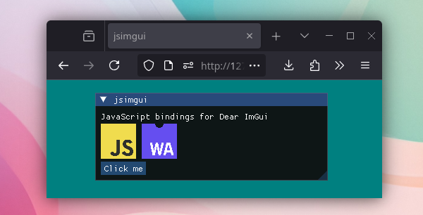

# jsimgui: JavaScript bindings for Dear ImGui



JavaScript/TypeScript bindings for the [Dear ImGui](https://github.com/ocornut/imgui) library.

## Features

- WebGL, WebGL2 and WebGPU supported
- Using docking branch of Dear ImGui
- Simple API which tries to feel familiar to the original
- Original comments preserved from Dear ImGui
- Good IDE support thanks to TypeScript

## Examples

**Clear canvas**

- **WebGL** - [View Example](https://mori2003.github.io/jsimgui/docs/examples/canvas/webgl/)

- **WebGL2** - [View Example](https://mori2003.github.io/jsimgui/docs/examples/canvas/webgl2/)

- **WebGPU** - [View Example](https://mori2003.github.io/jsimgui/docs/examples/canvas/webgpu/)

**Three.js**

- **Three.js WebGL2** - [View Example](https://mori2003.github.io/jsimgui/docs/examples/threejs/)

## Todo
The library should be somewhat usable, but expect bugs and missing features! (Custom font support, INI settings, etc.) Please open an issue if you find something.

## Quick Start

For more information, see the [wiki](https://github.com/mori2003/jsimgui/wiki).

```bash
npm install @mori2003/jsimgui
```

```js
import { ImGui, ImGuiImplWeb } from "@mori2003/jsimgui";

const myCanvas = document.querySelector("#imgui-canvas");

await ImGuiImplWeb.Init({
    canvas: myCanvas,
});

function frame() {
    ImGuiImplWeb.BeginRender();

    ImGui.Begin("New Window");
    ImGui.Text("Hello from JS!");
    ImGui.End();

    // Render your scene...

    ImGuiImplWeb.EndRender();
    requestAnimationFrame(frame);
}
requestAnimationFrame(frame);
```


## Building

### Prerequisites

- A Node.js compatible runtime (Node.js, Deno, Bun)
- [Emscripten](https://emscripten.org/)
- [Python](https://www.python.org/) with [Ply](https://pypi.org/project/ply/) (For dear_bindings)

### Build

#### 1. Clone the repository with submodules

```bash
git clone https://github.com/mori2003/jsimgui.git --recurse-submodules
cd jsimgui
```

```bash
npm install
```

#### 2. Run the build script

This will build the default library configuration: WebGL2, truetype font loader, no demos.

```bash
node build.ts
```

You can specify what configuration to build like so:

```bash
node build.ts --backend=webgpu --font-loader=freetype --demos

node build.ts --help # To see all options
```

## Project Structure

```
docs/         # Usage examples
src/          # Bindings generator source code
third_party/  # Dependencies (imgui, dear_bindings)
```
